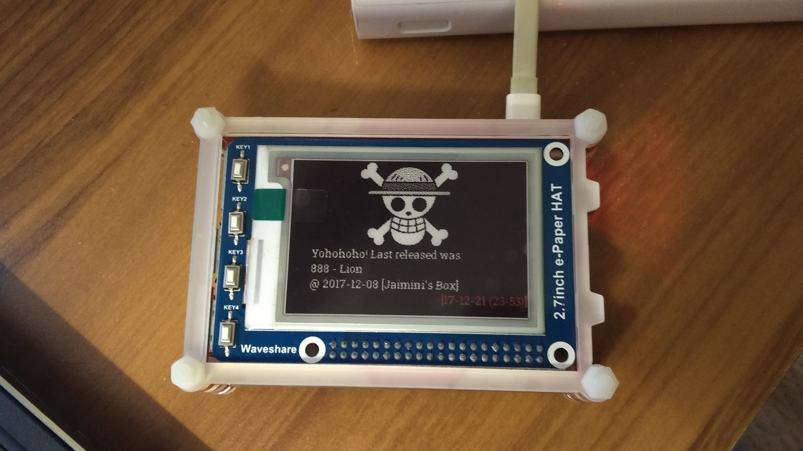
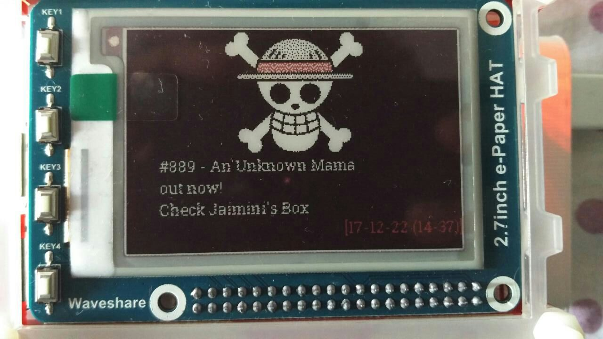
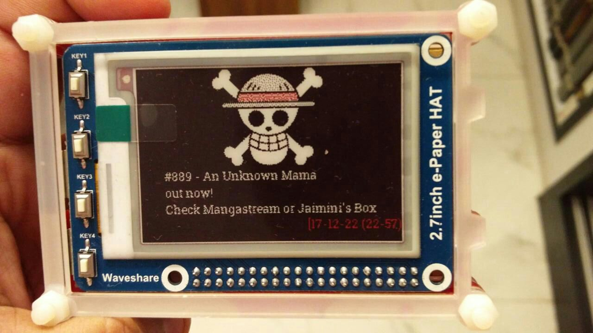

# nakama

This is a small script I wrote over a few hours to tell me if a new One Piece chapter was released in the last 4 days. It scans through Jaimini's box and Mangastream and prints out that information on a nice e-ink screen that I've hooked up to my Raspberry Pi 3.

## Photos

1. When it's been over 4 days since the last release:

2. When there's a new chapter up in the last 4 days on one of the two sites:

3. When there's a new chapter up in the last 4 days on both sites.

## Todo:

   * Sphinx documentation.
   * Video (?)
   * Success screenshot
   * crontab howto
  
